# Part 1: Basic RAG

A simple Retrieval-Augmented Generation (RAG) implementation without conversational memory.

## Overview

This is the foundational RAG pipeline that demonstrates the core concepts:
1. **Load** web content
2. **Split** into chunks
3. **Embed** text into vectors
4. **Retrieve** relevant documents
5. **Generate** answers using retrieved context

## Running Part 1

```bash
# From project root
yarn start:basic
```

## What It Does

1. Loads blog post content from Lilian Weng's ["LLM Powered Autonomous Agents"](https://lilianweng.github.io/posts/2023-06-23-agent/)
2. Splits content into 1000-character chunks with 200-character overlap
3. Creates embeddings and indexes using `nomic-embed-text`
4. Answers a single question: **"What is Task Decomposition?"**

**Expected time:** ~60-80s

## Example Output

```
📥 Loading web content...
✓ Loaded 68 document(s)

✂️  Splitting documents into chunks...
✓ Created 130 chunks

📊 Creating embeddings and indexing...
✓ Indexing complete

======================================================================
🚀 RUNNING BASIC RAG QUERY (Part 1)
======================================================================

❓ Question: "What is Task Decomposition?"

🔍 Retrieving relevant documents...
✓ Retrieved 4 document(s)

🤖 Generating answer with llama2...
✓ Answer generated

======================================================================
📝 ANSWER:
======================================================================
Task decomposition is the process of breaking down complex tasks into smaller,
more manageable steps. This allows an agent to plan ahead and tackle complicated
problems systematically...
======================================================================
⏱️  Time: 67.23s
======================================================================
```

## Architecture

```mermaid
graph LR
    subgraph "Data Preparation"
        A[📄 Web Page] -->|Load & Parse| B[📑 Raw Documents]
        B -->|Split Text| C[📚 Text Chunks]
        C -->|Create Embeddings| D[🔢 Vectors]
        D -->|Store| E[(Vector Store)]
    end
    
    subgraph "Query Processing"
        F[❓ Question] -->|Embed| G[🔍 Query Vector]
        G -->|Similarity Search| E
        E -->|Top K Results| H[📋 Context]
    end
    
    subgraph "Answer Generation"
        F --> I[📝 RAG Prompt]
        H --> I
        I -->|Question + Context| J[🤖 Llama2]
        J -->|Generate| K[✅ Answer]
    end
    
    style A fill:#e1f5ff,stroke:#0288d1,stroke-width:2px
    style E fill:#f3e5f5,stroke:#7b1fa2,stroke-width:2px
    style G fill:#fff3e0,stroke:#f57c00,stroke-width:2px
    style J fill:#e8f5e9,stroke:#388e3c,stroke-width:2px
    style K fill:#e8f5e9,stroke:#388e3c,stroke-width:2px
```



## Key Components

### 1. Document Loader
```typescript
const cheerioLoader = new CheerioWebBaseLoader(
  "https://lilianweng.github.io/posts/2023-06-23-agent/",
  { selector: "p" }
);
const docs = await cheerioLoader.load();
```
- Uses Cheerio to scrape web content
- Extracts only paragraph tags (`<p>`)

### 2. Text Splitter
```typescript
const splitter = new RecursiveCharacterTextSplitter({
  chunkSize: 1000,
  chunkOverlap: 200,
});
const allSplits = await splitter.splitDocuments(docs);
```
- Splits documents into 1000-character chunks
- 200-character overlap to preserve context at boundaries
- Recursive splitting tries to break at natural boundaries (paragraphs, sentences)

### 3. Vector Store & Embeddings
```typescript
const embeddings = new OllamaEmbeddings({
  baseUrl: "http://localhost:11434",
  model: "nomic-embed-text",
});

const vectorStore = new MemoryVectorStore(embeddings);
await vectorStore.addDocuments(allSplits);
```
- `nomic-embed-text` creates 768-dimensional vectors
- In-memory storage (doesn't persist between runs)
- Fast similarity search using cosine distance

### 4. LangGraph State Machine
```typescript
const graph = new StateGraph(StateAnnotation)
  .addNode("retrieve", retrieve)
  .addNode("generate", generate)
  .addEdge("__start__", "retrieve")
  .addEdge("retrieve", "generate")
  .addEdge("generate", "__end__")
  .compile();
```
- Linear pipeline: Start → Retrieve → Generate → End
- Type-safe state management with annotations

### 5. RAG Prompt
```typescript
const promptTemplate = await pull<ChatPromptTemplate>("rlm/rag-prompt");
```
- Uses LangChain's pre-built RAG prompt template
- Instructs the LLM to answer based on provided context
- Handles cases where the answer isn't in the context

## Implementation Details

### State Definition
```typescript
const StateAnnotation = Annotation.Root({
  question: Annotation<string>,
  context: Annotation<Document[]>,
  answer: Annotation<string>,
});
```
- `question`: User's input question
- `context`: Retrieved documents
- `answer`: Generated response

### Retrieve Node
```typescript
const retrieve = async (state: typeof InputStateAnnotation.State) => {
  const retrievedDocs = await vectorStore.similaritySearch(state.question);
  return { context: retrievedDocs };
};
```
- Takes question from state
- Searches vector store for similar documents
- Returns top matches as context

### Generate Node
```typescript
const generate = async (state: typeof StateAnnotation.State) => {
  const docsContent = state.context.map((doc) => doc.pageContent).join("\n");
  const messages = await promptTemplate.invoke({ 
    question: state.question, 
    context: docsContent 
  });
  const response = await llm.invoke(messages);
  return { answer: response.content };
};
```
- Combines retrieved documents into a single context string
- Formats RAG prompt with question and context
- Invokes LLM to generate answer

## Configuration

### Models Used
- **LLM**: `llama2` (~3.8GB)
- **Embeddings**: `nomic-embed-text` (~274MB)

### Parameters
- **Chunk Size**: 1000 characters
- **Chunk Overlap**: 200 characters
- **Retrieval**: Top 4 most similar documents
- **Temperature**: 0 (deterministic)

## Limitations

1. **No Conversation Memory**: Each query is independent
2. **Single Source**: Only loads one blog post
3. **In-Memory Storage**: Vector store doesn't persist
4. **Fixed Pipeline**: Always retrieves, even if not needed
5. **No Validation**: Doesn't check if retrieved docs are relevant

## Next Steps

- **Part 2**: Adds conversational memory for follow-up questions
- **Part 3**: Adds intelligent decision-making and self-correction

## Resources

- [LangChain RAG Tutorial](https://js.langchain.com/docs/tutorials/rag/)
- [RecursiveCharacterTextSplitter Docs](https://js.langchain.com/docs/modules/data_connection/document_transformers/)
- [Vector Stores in LangChain](https://js.langchain.com/docs/modules/data_connection/vectorstores/)

