# Part 2: Conversational RAG with Chat History

A RAG system that maintains conversation context across multiple turns. Implements **both approaches** from the [LangChain tutorial](https://js.langchain.com/docs/tutorials/qa_chat_history/):

1. **Chains Approach** - Predictable, one retrieval per question
2. **Agents Approach** - Flexible, agent decides when to retrieve

## Two Approaches

### Approach A: Chains (index-chains.ts)
- **Execution**: Exactly ONE retrieval per question
- **Uses**: `createHistoryAwareRetriever` + `createRetrievalChain`
- **Model**: `llama2`
- **Best for**: Standard Q&A with predictable flow

### Approach B: Agents (index-agents.ts)
- **Execution**: 0 to N retrievals (agent decides)
- **Uses**: LangGraph `createReactAgent` with native tool calling
- **Model**: `qwen2.5:3b` (requires tool-calling support)
- **Best for**: Complex questions needing multiple pieces of information

## Running Part 2

**Prerequisites for Agents:**
```bash
docker exec ollama-server ollama pull qwen2.5:3b
# Alternative models: llama3.1, mistral, etc.
```

**Run:**
```bash
# Chains approach (one retrieval per question)
yarn start:chat

# Agents approach (flexible retrievals)
yarn start:chat:agents
```

## What They Do

Both run a 3-turn conversation:
1. "What is Task Decomposition?"
2. "What are common ways of doing it?" ← Understands "it" = task decomposition
3. "Can you compare the different approaches and tell me which one is most commonly used?"

**Time:**
- Chains: ~180-240s (3 questions × ~60-80s each, predictable)
- Agents: ~150-300s (varies based on agent decisions)

## Architecture

### Chains Approach (Fixed Pipeline)

```mermaid
graph LR
    subgraph "Chat History"
        A[💬 Previous Messages]
        B[🆕 New Question]
    end
    
    subgraph "Reformulation"
        B --> C[🔄 History-Aware Retriever]
        A --> C
        C -->|Standalone Question| D[📝 Reformulated Query]
    end
    
    subgraph "Retrieval"
        D -->|Search| E[(📚 Vector Store)]
        E --> F[📋 Retrieved Docs]
    end
    
    subgraph "Generation"
        F --> G[💬 QA Chain]
        B --> G
        A --> G
        G --> H[🤖 LLM]
        H --> I[✅ Answer]
    end
    
    subgraph "Update"
        I --> J[💾 Update History]
        B --> J
    end
    
    J -.->|Next Turn| A
    
    style D fill:#e1f5ff,stroke:#0288d1,stroke-width:2px
    style E fill:#f3e5f5,stroke:#7b1fa2,stroke-width:2px
    style H fill:#fff3e0,stroke:#f57c00,stroke-width:2px
    style I fill:#e8f5e9,stroke:#388e3c,stroke-width:2px
    style J fill:#e8f5e9,stroke:#388e3c,stroke-width:2px
```



**Flow**: `Question → Reformulate → Retrieve (1x) → Answer`

---

### Agents Approach (Dynamic Loop)

```mermaid
graph LR
    subgraph "Chat History"
        A[💬 Previous Messages]
        B[🆕 New Question]
    end
    
    subgraph "Agent Decision Loop"
        A --> C{🤖 Agent Node}
        B --> C
        C -->|Needs Info| D[📝 Generate Tool Call]
        F[💬 Tool Results] --> C
    end
    
    subgraph "Document Retrieval"
        D --> E[🔍 Retrieve Node]
        E -->|Search| G[(📚 Vector Store)]
        G --> F
    end
    
    subgraph "Answer Generation"
        C -->|Has Enough Info| H[✅ Final Answer]
    end
    
    subgraph "State Update"
        H --> I[💾 Add to History]
        B --> I
        I --> J[📚 Updated History]
    end
    
    J -.->|Next Turn| A
    
    style C fill:#e1f5ff,stroke:#0288d1,stroke-width:2px
    style E fill:#f3e5f5,stroke:#7b1fa2,stroke-width:2px
    style G fill:#f3e5f5,stroke:#7b1fa2,stroke-width:2px
    style H fill:#e8f5e9,stroke:#388e3c,stroke-width:2px
```



**Flow**: `Question → Agent → [Retrieve → Agent]* → Answer` (loops as needed)

## Key Implementation

### Chains Approach

**1. History-Aware Retriever**
```typescript
const historyAwareRetriever = await createHistoryAwareRetriever({
  llm,
  retriever,
  rephrasePrompt: contextualizeQPrompt,
});
```

**2. RAG Chain**
```typescript
const ragChain = await createRetrievalChain({
  retriever: historyAwareRetriever,
  combineDocsChain: questionAnswerChain,
});
```

**3. Chat History**
```typescript
const chatHistory: BaseMessage[] = [];

async function askQuestion(question: string) {
  const result = await ragChain.invoke({
    input: question,
    chat_history: chatHistory,
  });
  
  chatHistory.push(new HumanMessage(question));
  chatHistory.push(new AIMessage(result.answer));
}
```

---

### Agents Approach

Following the [official tutorial](https://js.langchain.com/docs/tutorials/qa_chat_history/#agents).

**1. Create Retriever Tool**
```typescript
import { createRetrieverTool } from "langchain/tools/retriever";

const tool = createRetrieverTool(retriever, {
  name: "retrieve_blog_posts",
  description: "Search and return information about LLM agents..."
});
```

**2. Create ReAct Agent**
```typescript
import { createReactAgent } from "@langchain/langgraph/prebuilt";

const agent = createReactAgent({ 
  llm,  // qwen2.5:3b or similar with tool-calling support
  tools: [tool],
});
```

**3. Stream Execution**
```typescript
const chatHistory: BaseMessage[] = [];

async function askQuestion(question: string) {
  for await (const step of await agent.stream(
    { messages: [...chatHistory, new HumanMessage(question)] },
    { streamMode: "values" }
  )) {
    // Process agent steps: tool calls, results, final answer
  }
  
  chatHistory.push(new HumanMessage(question));
  chatHistory.push(new AIMessage(finalAnswer));
}
```

**Agent automatically:**
- Decides when to call retrieval tool
- Can make 0-N tool calls based on information needs
- Maintains chat history for context

## Comparison

| Feature | Chains (2A) | Agents (2B) |
|---------|-------------|-------------|
| **Retrievals/question** | Exactly 1 | 0 to N |
| **Execution flow** | Fixed pipeline | Dynamic loop |
| **Predictability** | High | Variable |
| **Speed** | ~60-80s/question | Varies |
| **Model** | llama2 | qwen2.5:3b (tool-calling) |
| **Best for** | Standard Q&A | Complex questions |
| **Implementation** | LangChain chains | LangGraph ReAct agent |

## Configuration

**Models:**
- **LLM (Chains)**: `llama2` (~3.8GB)
- **LLM (Agents)**: `qwen2.5:3b` (~2GB)
- **Embeddings**: `nomic-embed-text` (~274MB)

**Parameters:**
- Chunk Size: 1000 characters
- Chunk Overlap: 200 characters
- Temperature: 0 (deterministic)
- Retrieved Docs: 3 per query

## Advantages & Limitations

### Chains
✅ Fast and predictable  
✅ Simple implementation  
✅ Easy to debug  
❌ Always retrieves once (even if unnecessary)  
❌ No validation of retrieved docs  
❌ No self-correction

### Agents
✅ Flexible retrieval (0-N times)  
✅ Handles complex questions  
✅ Context-aware decisions  
❌ Slower (multiple retrievals)  
❌ Less predictable  
❌ Requires tool-calling model

### Both
❌ History grows unbounded (memory concern)  
❌ May exceed context window in long conversations

## Memory Management

For long conversations:
```typescript
// Keep only last N messages
const MAX_HISTORY = 10;
if (chatHistory.length > MAX_HISTORY) {
  chatHistory.splice(0, chatHistory.length - MAX_HISTORY);
}
```

## Next Steps

**Part 3** adds intelligent decision-making, document grading, and self-correction loops.

## Resources

- [LangChain Q&A with Chat History Tutorial](https://js.langchain.com/docs/tutorials/qa_chat_history)
- [History-Aware Retriever](https://js.langchain.com/docs/how_to/qa_chat_history_how_to/)
- [ReAct Agents](https://js.langchain.com/docs/how_to/migrate_agent/)
