# Part 2: Conversational RAG with Chat History

A RAG system that maintains conversation context across multiple turns. This part implements **both approaches** from the [LangChain tutorial](https://js.langchain.com/docs/tutorials/qa_chat_history/):

1. **Chains Approach** - Predictable, one retrieval per question
2. **Agents Approach** - Flexible, multiple retrievals per question

## Two Approaches

### Approach A: Chains (index-chains.ts)
- **Predictable execution**: Exactly ONE retrieval step per question
- **History-aware retrieval**: Reformulates questions based on chat history
- **Uses**: `createHistoryAwareRetriever` and `createRetrievalChain`
- **Best for**: Standard Q&A where one retrieval is sufficient

### Approach B: Agents (index-agents.ts)
- **Flexible execution**: Agent can make MULTIPLE retrieval calls per question
- **Iterative reasoning**: Agent decides when it has enough information
- **Uses**: LangGraph agent with tool calling loop
- **Best for**: Complex questions requiring multiple pieces of information

## Running Part 2

```bash
# Chains approach (one retrieval per question)
yarn start:chat

# Agents approach (multiple retrievals per question)
yarn start:chat:agents
```

## What They Do

### Chains Approach (index-chains.ts)
Runs a 3-turn conversation with **one retrieval** per question:

1. **Turn 1**: "What is Task Decomposition?"
2. **Turn 2**: "What are common ways of doing it?" (understands "it" = task decomposition)
3. **Turn 3**: "Can you give me specific examples?" (maintains full conversation context)

**Expected time:** ~180-240s (3 questions × ~60-80s each)

### Agents Approach (index-agents.ts)
Runs a 3-turn conversation where agent can make **multiple retrievals**:

1. **Turn 1**: "What is Task Decomposition?" (may retrieve once)
2. **Turn 2**: "What are common ways of doing it?" (may retrieve once)
3. **Turn 3**: "Can you compare the different approaches and tell me which one is most commonly used?" (may retrieve multiple times to gather comprehensive information)

**Expected time:** ~200-300s (varies based on agent decisions)

## Example Conversation

```
======================================================================
🚀 STARTING CONVERSATIONAL RAG SESSION
======================================================================

👤 Human: What is Task Decomposition?
----------------------------------------------------------------------
🤖 AI: Task decomposition involves breaking down complex tasks into smaller,
      more manageable steps. This technique helps agents handle complicated
      problems by addressing them systematically...
----------------------------------------------------------------------
⏱️  Time: 67.2s
======================================================================

👤 Human: What are common ways of doing it?
----------------------------------------------------------------------
[System internally reformulates to: "What are common ways of doing task decomposition?"]
🤖 AI: Based on our previous discussion, common methods include Chain of Thought (CoT),
      simple prompting like "Steps for XYZ", and task-specific instructions. CoT
      encourages the model to think step-by-step...
----------------------------------------------------------------------
⏱️  Time: 71.5s
======================================================================

👤 Human: Can you give me specific examples?
----------------------------------------------------------------------
[System reformulates with full context]
🤖 AI: Specific examples include using prompts like "What are the subgoals for
      achieving XYZ?" or providing task-specific instructions such as "Write a
      story outline" for creative writing tasks...
----------------------------------------------------------------------
⏱️  Time: 68.8s
======================================================================
```

## Architecture

### Chains Approach (Fixed Pipeline)

```mermaid
graph LR
    subgraph "Chat History"
        A[💬 Previous Messages] 
        B[🆕 New Question]
    end
    
    subgraph "Question Reformulation"
        A --> C[🔄 History-Aware Retriever]
        B --> C
        C -->|Reformulate| D[🤖 LLM]
        D --> E[📝 Standalone Question]
    end
    
    subgraph "Document Retrieval"
        E -->|Search| F[(Vector Store)]
        F --> G[📋 Retrieved Docs]
    end
    
    subgraph "Answer Generation"
        G --> H[📝 QA Chain]
        A --> H
        B --> H
        H --> I[🤖 LLM]
        I --> J[✅ Answer]
    end
    
    subgraph "State Update"
        B --> K[💾 Add to History]
        J --> K
        K --> L[📚 Updated History]
    end
    
    L -.->|Next Turn| A
    
    style B fill:#e1f5ff,stroke:#0288d1,stroke-width:2px
    style D fill:#fff3e0,stroke:#f57c00,stroke-width:2px
    style F fill:#f3e5f5,stroke:#7b1fa2,stroke-width:2px
    style I fill:#fff3e0,stroke:#f57c00,stroke-width:2px
    style J fill:#e8f5e9,stroke:#388e3c,stroke-width:2px
```



**Key**: Linear flow, exactly ONE retrieval per question.

---

### Agents Approach (Iterative Loop)

```mermaid
graph LR
    START[🆕 Question + 💬 Chat History] --> AGENT{🤖 Agent Node}
    
    AGENT -->|Needs Info| TOOL[📝 Generate Tool Call]
    TOOL --> RETRIEVE[🔍 Retrieve Node]
    RETRIEVE --> VECTOR[(Vector Store)]
    VECTOR --> DOCS[📋 Retrieved Docs]
    DOCS --> MESSAGES[💬 Add to Messages]
    MESSAGES --> AGENT
    
    AGENT -->|Has Enough Info| ANSWER[✅ Final Answer]
    
    ANSWER --> UPDATE[💾 Update Chat History]
    UPDATE --> READY[📚 Ready for Next Turn]
    
    style AGENT fill:#e1f5ff,stroke:#0288d1,stroke-width:2px
    style RETRIEVE fill:#f3e5f5,stroke:#7b1fa2,stroke-width:2px
    style ANSWER fill:#e8f5e9,stroke:#388e3c,stroke-width:2px
```



**Key**: Agent can loop through retrieval 0-N times until it decides it has enough information.

**Major Difference**: 
- **Chains**: `Question → Reformulate → Retrieve (1x) → Answer`
- **Agents**: `Question → Agent → [Retrieve → Agent]* → Answer` (loop repeats as needed)

## Key Components

### Chains Approach (index-chains.ts)

#### 1. History-Aware Retriever

Reformulates questions based on chat history before retrieving documents.

```typescript
const contextualizeQPrompt = ChatPromptTemplate.fromMessages([
  ["system", contextualizeQSystemPrompt],
  new MessagesPlaceholder("chat_history"),
  ["human", "{input}"],
]);

const historyAwareRetriever = await createHistoryAwareRetriever({
  llm,
  retriever,
  rephrasePrompt: contextualizeQPrompt,
});
```

**System Prompt:**
> "Given a chat history and the latest user question which might reference context in the chat history, formulate a standalone question which can be understood without the chat history. Do NOT answer the question, just reformulate it if needed."

**Why This Matters:**
- Turn 2 input: "What are common ways of doing it?"
- Reformulated: "What are common ways of doing task decomposition?"
- Retrieval now works correctly without chat context

#### 2. Question-Answering Chain

Generates answers using retrieved documents and chat history.

```typescript
const qaPrompt = ChatPromptTemplate.fromMessages([
  ["system", qaSystemPrompt],
  new MessagesPlaceholder("chat_history"),
  ["human", "{input}"],
]);

const questionAnswerChain = await createStuffDocumentsChain({
  llm,
  prompt: qaPrompt,
});
```

**System Prompt:**
> "You are an assistant for question-answering tasks. Use the following pieces of retrieved context to answer the question. If you don't know the answer, just say that you don't know. Use three sentences maximum and keep the answer concise."

#### 3. Retrieval Chain

Orchestrates the complete RAG pipeline with history.

```typescript
const ragChain = await createRetrievalChain({
  retriever: historyAwareRetriever,
  combineDocsChain: questionAnswerChain,
});
```

Execution flow:
1. Reformulate question using history
2. Retrieve documents using reformulated question
3. Generate answer using documents + history + original question

#### 4. Chat History Management

```typescript
const chatHistory: BaseMessage[] = [];

async function askQuestion(question: string) {
  const result = await ragChain.invoke({
    input: question,
    chat_history: chatHistory,
  });
  
  // Update history after each turn
  chatHistory.push(new HumanMessage(question));
  chatHistory.push(new AIMessage(result.answer));
  
  return result.answer;
}
```

**History Structure:**
```
Turn 1: [HumanMessage("What is Task Decomposition?"), AIMessage("Task decomposition is...")]
Turn 2: [...previous..., HumanMessage("What are common ways?"), AIMessage("Common methods include...")]
Turn 3: [...all previous..., HumanMessage("Give examples?"), AIMessage("Examples include...")]
```

### Agents Approach (index-agents.ts)

#### 1. Agent Node
Makes autonomous decisions about retrieval:

```typescript
async function agent(state) {
  const systemPrompt = `You have access to a retrieval tool.
  If you need information, respond with:
  TOOL_CALL: retrieve
  QUERY: <your search query>
  
  You can call the tool multiple times. When you have enough info, answer.`;
  
  const response = await llm.invoke([systemPrompt, ...messages]);
  
  if (response.content.includes("TOOL_CALL: retrieve")) {
    // Agent wants to retrieve
    return { messages: [AIMessage with tool_call] };
  } else {
    // Agent has final answer
    return { messages: [response] };
  }
}
```

**Key Features:**
- Examines full chat history for context
- Decides when to retrieve (0, 1, or multiple times)
- Loops until satisfied with information gathered

#### 2. Retrieve Node
Executes retrieval when agent decides to:

```typescript
async function executeRetrieval(state) {
  const query = lastMessage.additional_kwargs.tool_query;
  const docs = await retriever.invoke(query);
  const context = docs.map(doc => doc.pageContent).join("\n\n");
  
  return { messages: [ToolMessage(context)] };
}
```

#### 3. Graph with Conditional Routing

```typescript
const graph = new StateGraph(AgentState)
  .addNode("agent", agent)
  .addNode("retrieve", executeRetrieval)
  .addEdge(START, "agent")
  .addConditionalEdges("agent", shouldContinue, {
    retrieve: "retrieve",  // If tool call
    end: END,             // If final answer
  })
  .addEdge("retrieve", "agent")  // Back to agent after retrieval
  .compile();
```

**Agent Loop:**
```
START → Agent → (needs info?) → Retrieve → Agent → (needs more?) → Retrieve → Agent → (satisfied) → END
```

The agent keeps looping through retrieval until it has enough information to answer completely.

## Implementation Details

### Reformulation Examples

| User Input | Reformulated Query |
|------------|-------------------|
| "What is Task Decomposition?" | "What is Task Decomposition?" (no change) |
| "What are common ways of doing it?" | "What are common ways of doing task decomposition?" |
| "Can you give me specific examples?" | "Can you give me specific examples of task decomposition methods?" |
| "How does it help agents?" | "How does task decomposition help LLM agents?" |

### Message Placeholders

`MessagesPlaceholder` allows dynamic insertion of message arrays:

```typescript
new MessagesPlaceholder("chat_history")
// At runtime, replaced with:
[
  HumanMessage("What is Task Decomposition?"),
  AIMessage("Task decomposition is..."),
  HumanMessage("What are common ways?"),
  // ... etc
]
```

### Chain Composition

```
User Question
    ↓
createHistoryAwareRetriever
    ├─ Uses: LLM + retriever + chat_history
    ├─ Output: Reformulated question
    ↓
Vector Store Search
    ├─ Uses: Reformulated question
    ├─ Output: Retrieved documents
    ↓
createStuffDocumentsChain
    ├─ Uses: LLM + documents + chat_history + original question
    ├─ Output: Final answer
    ↓
Update Chat History
    ├─ Append: HumanMessage + AIMessage
```

## Configuration

### Models
- **LLM**: `llama2` (~3.8GB)
- **Embeddings**: `nomic-embed-text` (~274MB)

### Parameters
- **Chunk Size**: 1000 characters
- **Chunk Overlap**: 200 characters
- **Temperature**: 0 (deterministic)
- **Max Response**: 3 sentences (chains) / varies (agents)

## Comparison

### Part 2 Approaches Compared

| Feature | Chains (2A) | Agents (2B) |
|---------|-------------|-------------|
| **Retrievals per question** | Exactly 1 | 0 to N (agent decides) |
| **Execution flow** | Fixed pipeline | Dynamic loop |
| **Predictability** | High | Variable |
| **Best for** | Standard Q&A | Complex, multi-part questions |
| **Implementation** | LangChain chains | LangGraph + agent |
| **Speed** | Faster (fixed steps) | Slower (iterative) |

### vs Part 1

| Feature | Part 1 | Part 2 (Both) |
|---------|--------|--------|
| **Conversation** | ❌ No | ✅ Yes |
| **Question Reformulation** | ❌ No | ✅ Yes |
| **Chat History** | ❌ No | ✅ Yes (BaseMessage[]) |
| **Complexity** | Simple | Moderate |

## Advantages

### Chains Approach (index-chains.ts)
✅ **Context Awareness**: Understands pronouns and references to previous turns  
✅ **Automatic Reformulation**: Handles ambiguous follow-up questions  
✅ **Predictable**: Fixed execution path, easy to debug  
✅ **Fast**: Single retrieval per question (~60-80s per turn)  
✅ **Simple**: Uses battle-tested LangChain chains  

### Agents Approach (index-agents.ts)
✅ **Flexible Retrieval**: Can retrieve 0, 1, or many times as needed  
✅ **Thorough**: Gathers all necessary information before answering  
✅ **Complex Questions**: Handles multi-part questions requiring synthesis  
✅ **Adaptive**: Adjusts behavior based on question complexity  
✅ **Context Aware**: Maintains chat history like chains

## Limitations

### Chains Approach (index-chains.ts)
1. **Always Retrieves Once**: Can't skip retrieval or retrieve multiple times
2. **No Validation**: Doesn't check if retrieved docs are relevant
3. **Linear Flow**: No conditional logic or loops
4. **No Self-Correction**: Can't rewrite queries if retrieval fails

### Agents Approach (index-agents.ts)
1. **Slower**: Multiple retrievals increase latency (varies by question)
2. **Unpredictable**: Agent decisions vary, harder to debug
3. **LLM-Dependent**: Quality depends on agent making good decisions
4. **Prompt Engineering**: Requires careful prompt design for llama2

### Both Approaches
- **Growing History**: History grows unbounded (memory issue for long conversations)
- **Context Window**: Very long conversations may exceed LLM context limit

## Memory Management

For long conversations, consider truncating history:

```typescript
// Keep only last N messages
const MAX_HISTORY = 10;
if (chatHistory.length > MAX_HISTORY) {
  chatHistory.splice(0, chatHistory.length - MAX_HISTORY);
}
```

Or use a summarization approach:
```typescript
// Summarize old messages periodically
if (chatHistory.length > 20) {
  const summary = await summarizeHistory(chatHistory.slice(0, 10));
  chatHistory = [
    new HumanMessage(`Previous conversation summary: ${summary}`),
    ...chatHistory.slice(10)
  ];
}
```

## Next Steps

- **Part 3**: Adds intelligent decision-making, document grading, and self-correction

## Resources

- [LangChain Q&A with Chat History Tutorial](https://js.langchain.com/docs/tutorials/qa_chat_history)
- [History-Aware Retriever](https://js.langchain.com/docs/how_to/qa_chat_history_how_to/)
- [Message History](https://js.langchain.com/docs/how_to/message_history/)
- [Chat History Management Best Practices](https://js.langchain.com/docs/concepts/chat_history/)

