# Part 2: Conversational RAG with Chat History

A RAG system that maintains conversation context across multiple turns using LangChain's retrieval chains.

## Overview

This implementation adds conversational capabilities to RAG:
- **History-Aware Retrieval**: Reformulates questions based on chat history
- **Context Preservation**: Maintains conversation state across multiple turns
- **Chain-Based Architecture**: Uses LangChain's pre-built chains for reliable execution

## Running Part 2

```bash
# From project root
yarn start:chat
```

## What It Does

Runs a 3-turn conversation demonstrating context awareness:

1. **Turn 1**: "What is Task Decomposition?"
2. **Turn 2**: "What are common ways of doing it?" (understands "it" = task decomposition)
3. **Turn 3**: "Can you give me specific examples?" (maintains full conversation context)

**Expected time:** ~180-240s (3 questions × ~60-80s each)

## Example Conversation

```
======================================================================
🚀 STARTING CONVERSATIONAL RAG SESSION
======================================================================

👤 Human: What is Task Decomposition?
----------------------------------------------------------------------
🤖 AI: Task decomposition involves breaking down complex tasks into smaller,
      more manageable steps. This technique helps agents handle complicated
      problems by addressing them systematically...
----------------------------------------------------------------------
⏱️  Time: 67.2s
======================================================================

👤 Human: What are common ways of doing it?
----------------------------------------------------------------------
[System internally reformulates to: "What are common ways of doing task decomposition?"]
🤖 AI: Based on our previous discussion, common methods include Chain of Thought (CoT),
      simple prompting like "Steps for XYZ", and task-specific instructions. CoT
      encourages the model to think step-by-step...
----------------------------------------------------------------------
⏱️  Time: 71.5s
======================================================================

👤 Human: Can you give me specific examples?
----------------------------------------------------------------------
[System reformulates with full context]
🤖 AI: Specific examples include using prompts like "What are the subgoals for
      achieving XYZ?" or providing task-specific instructions such as "Write a
      story outline" for creative writing tasks...
----------------------------------------------------------------------
⏱️  Time: 68.8s
======================================================================
```

## Architecture

```mermaid
graph LR
    subgraph "Chat History"
        A[💬 Previous Messages] 
        B[🆕 New Question]
    end
    
    subgraph "Question Reformulation"
        A --> C[🔄 History-Aware Retriever]
        B --> C
        C -->|Reformulate| D[🤖 LLM]
        D --> E[📝 Standalone Question]
    end
    
    subgraph "Document Retrieval"
        E -->|Search| F[(Vector Store)]
        F --> G[📋 Retrieved Docs]
    end
    
    subgraph "Answer Generation"
        G --> H[📝 QA Chain]
        A --> H
        B --> H
        H --> I[🤖 LLM]
        I --> J[✅ Answer]
    end
    
    subgraph "State Update"
        B --> K[💾 Add to History]
        J --> K
        K --> L[📚 Updated History]
    end
    
    L -.->|Next Turn| A
```



## Key Components

### 1. History-Aware Retriever

Reformulates questions based on chat history before retrieving documents.

```typescript
const contextualizeQPrompt = ChatPromptTemplate.fromMessages([
  ["system", contextualizeQSystemPrompt],
  new MessagesPlaceholder("chat_history"),
  ["human", "{input}"],
]);

const historyAwareRetriever = await createHistoryAwareRetriever({
  llm,
  retriever,
  rephrasePrompt: contextualizeQPrompt,
});
```

**System Prompt:**
> "Given a chat history and the latest user question which might reference context in the chat history, formulate a standalone question which can be understood without the chat history. Do NOT answer the question, just reformulate it if needed."

**Why This Matters:**
- Turn 2 input: "What are common ways of doing it?"
- Reformulated: "What are common ways of doing task decomposition?"
- Retrieval now works correctly without chat context

### 2. Question-Answering Chain

Generates answers using retrieved documents and chat history.

```typescript
const qaPrompt = ChatPromptTemplate.fromMessages([
  ["system", qaSystemPrompt],
  new MessagesPlaceholder("chat_history"),
  ["human", "{input}"],
]);

const questionAnswerChain = await createStuffDocumentsChain({
  llm,
  prompt: qaPrompt,
});
```

**System Prompt:**
> "You are an assistant for question-answering tasks. Use the following pieces of retrieved context to answer the question. If you don't know the answer, just say that you don't know. Use three sentences maximum and keep the answer concise."

### 3. Retrieval Chain

Orchestrates the complete RAG pipeline with history.

```typescript
const ragChain = await createRetrievalChain({
  retriever: historyAwareRetriever,
  combineDocsChain: questionAnswerChain,
});
```

Execution flow:
1. Reformulate question using history
2. Retrieve documents using reformulated question
3. Generate answer using documents + history + original question

### 4. Chat History Management

```typescript
const chatHistory: BaseMessage[] = [];

async function askQuestion(question: string) {
  const result = await ragChain.invoke({
    input: question,
    chat_history: chatHistory,
  });
  
  // Update history after each turn
  chatHistory.push(new HumanMessage(question));
  chatHistory.push(new AIMessage(result.answer));
  
  return result.answer;
}
```

**History Structure:**
```
Turn 1: [HumanMessage("What is Task Decomposition?"), AIMessage("Task decomposition is...")]
Turn 2: [...previous..., HumanMessage("What are common ways?"), AIMessage("Common methods include...")]
Turn 3: [...all previous..., HumanMessage("Give examples?"), AIMessage("Examples include...")]
```

## Implementation Details

### Reformulation Examples

| User Input | Reformulated Query |
|------------|-------------------|
| "What is Task Decomposition?" | "What is Task Decomposition?" (no change) |
| "What are common ways of doing it?" | "What are common ways of doing task decomposition?" |
| "Can you give me specific examples?" | "Can you give me specific examples of task decomposition methods?" |
| "How does it help agents?" | "How does task decomposition help LLM agents?" |

### Message Placeholders

`MessagesPlaceholder` allows dynamic insertion of message arrays:

```typescript
new MessagesPlaceholder("chat_history")
// At runtime, replaced with:
[
  HumanMessage("What is Task Decomposition?"),
  AIMessage("Task decomposition is..."),
  HumanMessage("What are common ways?"),
  // ... etc
]
```

### Chain Composition

```
User Question
    ↓
createHistoryAwareRetriever
    ├─ Uses: LLM + retriever + chat_history
    ├─ Output: Reformulated question
    ↓
Vector Store Search
    ├─ Uses: Reformulated question
    ├─ Output: Retrieved documents
    ↓
createStuffDocumentsChain
    ├─ Uses: LLM + documents + chat_history + original question
    ├─ Output: Final answer
    ↓
Update Chat History
    ├─ Append: HumanMessage + AIMessage
```

## Configuration

### Models
- **LLM**: `llama2` (~3.8GB)
- **Embeddings**: `nomic-embed-text` (~274MB)

### Parameters
- **Chunk Size**: 1000 characters
- **Chunk Overlap**: 200 characters
- **Temperature**: 0 (deterministic)
- **Max Response**: 3 sentences (via system prompt)

## Key Differences from Part 1

| Feature | Part 1 | Part 2 |
|---------|--------|--------|
| **Conversation** | ❌ No | ✅ Yes |
| **Question Reformulation** | ❌ No | ✅ Yes |
| **Chat History** | ❌ No | ✅ Yes (BaseMessage[]) |
| **Architecture** | LangGraph nodes | LangChain chains |
| **Execution** | Custom graph | Pre-built chains |
| **Complexity** | Simple | Moderate |

## Advantages

✅ **Context Awareness**: Understands pronouns and references to previous turns  
✅ **Automatic Reformulation**: Handles ambiguous follow-up questions  
✅ **Reliable**: Uses battle-tested LangChain chains  
✅ **Predictable**: Linear execution flow  
✅ **Easy to Debug**: Clear chain structure  

## Limitations

1. **Always Retrieves**: Can't skip retrieval for simple questions
2. **No Validation**: Doesn't check if retrieved docs are relevant
3. **Linear Flow**: No conditional logic or loops
4. **Growing History**: History grows unbounded (memory issue for long conversations)
5. **No Self-Correction**: Can't rewrite queries if retrieval fails

## Memory Management

For long conversations, consider truncating history:

```typescript
// Keep only last N messages
const MAX_HISTORY = 10;
if (chatHistory.length > MAX_HISTORY) {
  chatHistory.splice(0, chatHistory.length - MAX_HISTORY);
}
```

Or use a summarization approach:
```typescript
// Summarize old messages periodically
if (chatHistory.length > 20) {
  const summary = await summarizeHistory(chatHistory.slice(0, 10));
  chatHistory = [
    new HumanMessage(`Previous conversation summary: ${summary}`),
    ...chatHistory.slice(10)
  ];
}
```

## Next Steps

- **Part 3**: Adds intelligent decision-making, document grading, and self-correction

## Resources

- [LangChain Q&A with Chat History Tutorial](https://js.langchain.com/docs/tutorials/qa_chat_history)
- [History-Aware Retriever](https://js.langchain.com/docs/how_to/qa_chat_history_how_to/)
- [Message History](https://js.langchain.com/docs/how_to/message_history/)
- [Chat History Management Best Practices](https://js.langchain.com/docs/concepts/chat_history/)

