# Part 3: Agentic RAG with LangGraph

An intelligent RAG agent implementing the **ReAct (Reasoning + Acting) framework** for autonomous decision-making, validation, and self-correction.

## Overview

This implementation follows the [LangChain Agentic RAG Tutorial](https://docs.langchain.com/oss/javascript/langgraph/agentic-rag) and demonstrates the **ReAct framework** applied to RAG - where the agent reasons about what to do, acts by using tools, observes results, and repeats in a loop until satisfied.

### What is ReAct?

**ReAct** (Reasoning and Acting) is a framework where LLMs:
1. **Reason** about what action to take
2. **Act** by executing tools
3. **Observe** the results
4. **Repeat** until the task is complete

This creates an autonomous agent that can think, try, evaluate, and self-correct - not just execute a fixed pipeline.

## Key Features

### 🤔 Intelligent Decision Making
- The agent decides whether to retrieve documents or respond directly
- Simple greetings get immediate responses without retrieval
- Complex questions trigger the retrieval tool

### 📊 Document Grading
- Validates relevance of retrieved documents before generating answers
- Uses LLM to assess if documents contain information relevant to the question
- Only generates answers when documents are deemed relevant

### ✍️ Self-Correction Loop
- If retrieved documents aren't relevant, the agent rewrites the query
- Improved query is used to retrieve again
- Loops until relevant documents are found

### 🔧 Prompt-Based Tool Architecture
- Uses prompt engineering for tool calling (llama2 compatible)
- Custom retrieve node executes vector store search
- Conditional edges route based on agent decisions

## ReAct Framework in Action

Part 3 implements the **ReAct (Reasoning + Acting) pattern** through a continuous loop:

### The ReAct Cycle

```
┌─────────────────────────────────────────────────────────┐
│                     ReAct Loop                          │
└─────────────────────────────────────────────────────────┘

1. REASON: "Should I retrieve or answer directly?"
   └─→ Agent analyzes the question
   
2. ACT: Execute the decided action
   ├─→ Simple query: Respond directly
   └─→ Complex query: Use retrieval tool
   
3. OBSERVE: Evaluate the results
   └─→ Grade documents: Are they relevant?
   
4. REASON: "Is this good enough?"
   ├─→ Yes: Generate final answer
   └─→ No: Rewrite query (back to step 2)
```

## Architecture

### Graph Structure (ReAct Flow)

```mermaid
graph LR
    subgraph "Initial Question"
        Q[❓ User Question]
    end
    
    subgraph "REASON: Decision Making"
        Q --> D{🤔 Analyze Question}
        D -->|Simple/Greeting| R1[💬 Direct Response]
        D -->|Needs Information| D2[📝 Formulate Search Query]
        RW[🔄 Query Rewriter] --> D
    end
    
    subgraph "ACT: Retrieval"
        D2 --> RET[🔍 Search Documents]
        RET -->|Execute| VS[(📚 Vector Store<br/>3 Blog Posts)]
        VS --> DOCS[📋 Retrieved Documents]
    end
    
    subgraph "OBSERVE: Quality Check"
        DOCS --> GRADE{📊 Grade Relevance}
        GRADE -->|✅ Relevant| GOOD[✓ Documents are useful]
        GRADE -->|❌ Not Relevant| BAD[✗ Documents inadequate]
    end
    
    subgraph "ACT: Response"
        GOOD --> GEN[✍️ Generate Answer<br/>with Context]
        R1 --> END1[🎯 Final Answer]
        GEN --> END1
    end
    
    subgraph "REASON: Self-Correction"
        BAD --> RW
    end
    
    style D fill:#e1f5ff,stroke:#0288d1,stroke-width:2px
    style GRADE fill:#fff3e0,stroke:#f57c00,stroke-width:2px
    style VS fill:#f3e5f5,stroke:#7b1fa2,stroke-width:2px
    style RET fill:#f3e5f5,stroke:#7b1fa2,stroke-width:2px
    style GEN fill:#e8f5e9,stroke:#388e3c,stroke-width:2px
    style END1 fill:#e8f5e9,stroke:#388e3c,stroke-width:2px
    style RW fill:#ffe0b2,stroke:#e64a19,stroke-width:2px
```



**Key**: ReAct loop with conditional routing and self-correction. The agent can take shortcuts (direct response) or loop through retrieval → grading → rewriting until satisfied.

### ReAct Framework Stages

The diagram shows the complete ReAct cycle with labeled subgraphs:

1. **REASON: Decision Making** 
   - Analyzes the question to determine if retrieval is needed
   - Simple questions get direct responses
   - Complex questions trigger the retrieval process
   - Receives rewritten queries from the self-correction loop

2. **ACT: Retrieval**
   - Formulates and executes search queries
   - Searches across 3 blog posts in the vector store
   - Returns relevant document chunks

3. **OBSERVE: Quality Check**
   - Grades retrieved documents for relevance
   - Evaluates if documents contain useful information
   - Routes to either generation or self-correction

4. **ACT: Response**
   - Generates final answer using validated context
   - Produces the output for the user

5. **REASON: Self-Correction**
   - Rewrites queries when documents aren't relevant
   - Feeds improved query back to Decision Making
   - Creates a feedback loop for continuous improvement

### Decision Points

- **Initial Analysis**: Should I retrieve information or respond directly?
- **Quality Check**: Are the retrieved documents relevant and useful?
- **Routing**: Generate answer with good documents, or rewrite query and try again?

## Data Sources

Loads and indexes three blog posts by Lilian Weng:
1. [LLM Powered Autonomous Agents](https://lilianweng.github.io/posts/2023-06-23-agent/)
2. [Prompt Engineering](https://lilianweng.github.io/posts/2023-03-15-prompt-engineering/)
3. [Adversarial Attacks on LLMs](https://lilianweng.github.io/posts/2023-10-25-adv-attack-llm/)

## Running the Demo

```bash
# Make sure Ollama is running with llama2 and nomic-embed-text models
docker-compose up -d

# Build and run
yarn start:agentic
```

## Expected Output

The demo runs three test queries:

### Test 1: Complex Question (Requires Retrieval)
```
Question: "What are the types of memory in LLM agents?"

Flow:
  generateQueryOrRespond → retrieve → gradeDocuments → generate

Expected: Detailed answer about memory types in LLM agents
```

### Test 2: Simple Greeting (No Retrieval)
```
Question: "Hello! How are you?"

Flow:
  generateQueryOrRespond → END

Expected: Direct response without retrieval
```

### Test 3: Specific Question (Retrieval + Grading)
```
Question: "What does Lilian Weng say about chain of thought prompting?"

Flow:
  generateQueryOrRespond → retrieve → gradeDocuments → generate

Expected: Answer about chain of thought from the blog posts
```

## Key Differences from Part 2

| Feature | Part 2 (Chains) | Part 3 (Agentic) |
|---------|----------------|------------------|
| **Decision Making** | Always retrieves | Decides if retrieval needed |
| **Validation** | No relevance checking | Grades document relevance |
| **Self-Correction** | No query rewriting | Rewrites queries if needed |
| **Execution Flow** | Linear chain | Conditional graph with loops |
| **Chat History** | Yes (conversational) | No (single-turn) |
| **Tool Calling** | No tools | Prompt-based tool calling |

## Technical Details

### Document Processing
- **Chunk Size**: 500 characters
- **Chunk Overlap**: 50 characters
- **Retrieval**: Top 3 most similar documents

### Models
- **LLM**: llama2 (for agent reasoning, grading, rewriting, generation)
  - Note: llama2 doesn't support native tool calling, so we use prompt-based approach
  - Alternative: Use llama3.1+, mistral, or qwen2.5 for native tool calling support
- **Embeddings**: nomic-embed-text (768-dimensional vectors)

### Prompts

**Document Grading Prompt**:
```
You are a grader assessing relevance of retrieved documents to a user question.
[Documents and question provided]
Respond with "yes" if relevant, "no" if not relevant.
```

**Query Rewriting Prompt**:
```
Look at the input and try to reason about the underlying semantic intent/meaning.
Formulate an improved question that is more specific and likely to retrieve relevant information.
```

**Answer Generation Prompt**:
```
You are an assistant for question-answering tasks.
Use the following pieces of retrieved context to answer the question.
Keep the answer concise (3 sentences max).
```

## Implementation Notes

### Tool Implementation (llama2 Compatible)

This implementation uses **prompt-based tool calling** instead of native tool APIs for llama2 compatibility:

**Why this approach?**
- llama2 doesn't support native function/tool calling
- The tutorial uses models with built-in tool support (like GPT-4)
- We use prompt engineering to achieve the same functionality

**How it works:**
1. **Prompt instructions**: LLM is instructed to respond with `TOOL_CALL: retrieve_blog_posts\nQUERY: <query>` when retrieval is needed
2. **Response parsing**: We parse the LLM's text response to detect tool calls
3. **Manual execution**: A custom `retrieve` node executes the vector store search
4. **Metadata storage**: Tool call info stored in `additional_kwargs` instead of `tool_calls`

**Code example:**
```typescript
// Instruct the LLM about tool availability via prompt
const systemPrompt = `You are a helpful assistant with access to a retrieval tool.

If the user asks a question requiring information from Lilian Weng's blog posts, respond with:
TOOL_CALL: retrieve_blog_posts
QUERY: <your search query>

Otherwise, respond normally.`;

// Parse response to detect tool usage
if (content.includes("TOOL_CALL: retrieve_blog_posts")) {
  const query = content.match(/QUERY: (.+)/)[1];
  // Execute retrieval manually
}
```

This achieves the same agentic behavior as the tutorial, but works with any LLM (not just those with native tool calling).

### State Management
Uses LangGraph's `Annotation.Root` for type-safe state:
```typescript
const GraphState = Annotation.Root({
  messages: Annotation<BaseMessage[]>({
    reducer: (x, y) => x.concat(y),
  }),
});
```

Messages accumulate throughout the graph execution, allowing nodes to access the full conversation history.

## Potential Enhancements

1. **Max Iterations**: Add a counter to prevent infinite rewriting loops
2. **Streaming**: Stream responses as they're generated
3. **Multi-tool Support**: Add more tools (web search, calculator, etc.)
4. **Conversation Memory**: Combine with Part 2's chat history
5. **Parallel Retrieval**: Retrieve from multiple sources simultaneously
6. **Confidence Scores**: Add numerical relevance scores instead of yes/no
7. **Human-in-the-Loop**: Allow human approval before tool execution

## Resources

- [LangGraph Documentation](https://langchain-ai.github.io/langgraph/)
- [Agentic RAG Tutorial](https://docs.langchain.com/oss/javascript/langgraph/agentic-rag)
- [LangGraph Conditional Edges](https://langchain-ai.github.io/langgraph/how-tos/branching/)
- [Tool Calling with LangChain](https://js.langchain.com/docs/modules/agents/tools/)

