# Part 3: Agentic RAG with ReAct Framework

An intelligent RAG agent implementing the **ReAct (Reasoning + Acting) framework** for autonomous decision-making, document validation, and self-correction.

## Overview

Unlike Part 2 (which uses a simple agent), Part 3 builds a **custom ReAct graph** with:
- **Decision Making**: Agent chooses to retrieve or respond
- **Document Grading**: Validates relevance after retrieval  
- **Self-Correction**: Rewrites queries if documents aren't relevant
- **Feedback Loops**: Continuous improvement until satisfied

### What is ReAct?

**ReAct** (Reasoning and Acting):
1. **Reason**: Decide what action to take
2. **Act**: Execute tools (retrieve documents)
3. **Observe**: Evaluate results (grade relevance)
4. **Learn**: Improve and try again if needed

Creates an autonomous agent that thinks, tries, evaluates, and self-corrects.

## Running Part 3

**Prerequisites:**
```bash
docker exec ollama-server ollama pull qwen2.5:3b
```

**Run:**
```bash
yarn start:agentic  # ~90-180s
```

## What It Does

Answers two questions using ReAct loop:
1. "What is Task Decomposition?"
2. "What are the types of agent memory?"

For each question, the agent:
- Decides whether to retrieve or answer directly
- Retrieves documents if needed
- Grades document relevance
- Rewrites query and retrieves again if not relevant
- Generates answer once it has good documents

## Architecture

### ReAct Flow

```mermaid
graph LR
    Q[❓ Question] --> A{🤔 Agent<br/>Decide<br/>🧠 LLM}
    
    subgraph "Path 1: Direct Answer"
        A -->|Simple/Greeting| R[💬 Direct Response<br/>🧠 LLM]
        R --> END1[🎯 Final Answer]
    end
    
    subgraph "Path 2: Retrieval & Validation"
        A -->|Needs Info| T[📝 Tool Call]
        T --> RET[🔍 Retrieve<br/>🔧 TOOL]
        RET --> VS[(📚 Vector Store)]
        VS --> DOCS[📋 Documents]
        DOCS --> G{📊 Grade<br/>🧠 LLM}
        G -->|✅ Relevant| GEN[✍️  Generate<br/>🧠 LLM]
        G -->|❌ Not Relevant| RW[🔄 Rewrite<br/>🧠 LLM]
        RW -->|Try Again| A
        GEN --> END2[🎯 Final Answer]
    end
    
    style A fill:#e1f5ff,stroke:#0288d1,stroke-width:2px
    style G fill:#fff3e0,stroke:#f57c00,stroke-width:2px
    style VS fill:#f3e5f5,stroke:#7b1fa2,stroke-width:2px
    style RET fill:#f3e5f5,stroke:#7b1fa2,stroke-width:2px
    style R fill:#e8f5e9,stroke:#388e3c,stroke-width:2px
    style GEN fill:#e8f5e9,stroke:#388e3c,stroke-width:2px
    style END1 fill:#e8f5e9,stroke:#388e3c,stroke-width:2px
    style END2 fill:#e8f5e9,stroke:#388e3c,stroke-width:2px
    style RW fill:#ffe0b2,stroke:#e64a19,stroke-width:2px
```



**Legend**: **🧠 LLM** = LLM reasoning/generation | **🔧 TOOL** = External tool

### The ReAct Loop

**1 → 2 → 3 → 4 (back to 1)** until documents are relevant:

1. **🧠 LLM** analyzes question → decides to retrieve or respond
2. **🔧 TOOL** searches vector store → returns documents  
3. **🧠 LLM** grades document relevance → routes to generation or rewrite
4. **🧠 LLM** rewrites query if needed → loops back to step 1

Agent continuously evaluates and improves until it gets relevant documents.

## Key Components

**5 Graph Nodes:**
1. **Agent**: Decides whether to retrieve or answer directly
2. **Retrieve**: Executes document retrieval via tool
3. **Grade**: Evaluates document relevance (relevant/not relevant)
4. **Rewrite**: Improves query if documents aren't relevant
5. **Generate**: Creates final answer from relevant documents

**Conditional Routing:**
- After Agent: → Retrieve (if tool call) or Generate (if direct answer)
- After Grade: → Generate (if relevant) or Rewrite (if not relevant)
- After Rewrite: → Agent (try again with new query)

**Feedback Loop:**
The Rewrite → Agent edge creates a self-correction loop that continues until relevant documents are found.

## Configuration

**Models:**
- **LLM**: `qwen2.5:3b` (~2GB) - requires tool-calling support
- **Embeddings**: `nomic-embed-text` (~274MB)

**Data Sources:**
- 3 blog posts from Lilian Weng
- ~200+ chunks (500 chars each, 50 overlap)
- 3 documents retrieved per query

**Parameters:**
- Temperature: 0 (deterministic)
- Chunk size: 500 characters
- Retrieved docs: 3 per query

## Comparison

### vs Part 2B (Agents)

| Feature | Part 2B | Part 3 |
|---------|---------|--------|
| **Agent Type** | Simple tool-calling | ReAct with grading |
| **Validation** | ❌ No | ✅ Grades documents |
| **Self-Correction** | ❌ No | ✅ Rewrites queries |
| **Graph** | Prebuilt `createReactAgent` | Custom LangGraph |
| **Complexity** | Simple | Advanced |
| **Use Case** | Chat with retrieval | Autonomous research |

### vs Part 2A (Chains)

| Feature | Part 2A | Part 3 |
|---------|---------|--------|
| **Chat History** | ✅ Yes | ❌ No (single turn) |
| **Retrieval** | Always 1x | 0-N (with grading) |
| **Validation** | ❌ No | ✅ Yes |
| **Flow** | Fixed pipeline | Conditional loops |

## Advantages

✅ **Intelligent Validation**: Grades document relevance before answering  
✅ **Self-Correction**: Automatically rewrites queries if retrieval fails  
✅ **Adaptive**: Loops until it finds relevant information  
✅ **Transparent**: Shows decision-making process  
✅ **Quality Control**: Won't generate answers from irrelevant docs

## Limitations

❌ **No Chat History**: Single-turn Q&A only (not conversational)  
❌ **Slower**: Multiple retrieval + grading steps increase latency  
❌ **Complex**: More nodes and conditional logic to debug  
❌ **Model Dependent**: Requires good grading and rewriting from LLM

## Next Steps

**Combine Part 2 + Part 3**: Add chat history to the ReAct framework for conversational agentic RAG with validation and self-correction.

## Resources

- [LangChain Agentic RAG Tutorial](https://docs.langchain.com/oss/javascript/langgraph/agentic-rag)
- [ReAct Paper](https://arxiv.org/abs/2210.03629)
- [LangGraph Documentation](https://langchain-ai.github.io/langgraph/)
- [Corrective RAG (CRAG)](https://arxiv.org/abs/2401.15884)
