# Part 4: Multi-Model Hybrid Search with ArangoDB

A **social network knowledge base** demonstrating true multi-model hybrid search by combining **3 types of search** in one query using **ArangoDB**.

## What is Hybrid Search?

**Hybrid search** means combining multiple search techniques to get better results than any single approach:

### The 3 Search Types Used:

#### 1. **BM25 Keyword Search** (Traditional IR)
- **What**: Classic full-text search using TF-IDF and document length normalization
- **When**: Finds exact keyword matches like "graph database" or "real-time messaging"
- **Strength**: Precision - finds documents with specific terms
- **Limitation**: Misses semantically similar content with different wording

#### 2. **Vector Similarity Search** (Semantic AI)
- **What**: Converts text to embeddings (768-dim vectors) and finds nearest neighbors
- **When**: Finds conceptually similar content even without exact keywords
- **Strength**: Recall - understands meaning and context
- **Limitation**: May miss exact technical terms or names

#### 3. **Graph Traversal** (Relationship-based)
- **What**: Follows edges in a graph to find connected documents
- **When**: Discovers related articles through their relationships
- **Strength**: Context expansion - finds relevant content via connections
- **Limitation**: Depends on quality of relationship data

### Why Combine All Three?

**Query**: "how to build friend connections"

- **BM25 alone**: Finds article with exact words "friend connections" ✅
- **Vector alone**: Finds "social graph" article (semantically similar) ✅
- **Graph traversal**: Discovers "user profiles" (enables friends) & "news feed" (uses connections) ✅

**Result**: 1 direct match becomes 5+ relevant articles by combining all three approaches!

## Architecture

### System Components

```mermaid
graph TB
    subgraph "User Layer"
        Q[🔍 Search Query<br/>"friend connections"]
    end
    
    subgraph "Application Layer"
        APP[📱 Search Application]
        EMB[🧠 Ollama Embeddings<br/>nomic-embed-text]
    end
    
    subgraph "ArangoDB Multi-Model Database"
        direction TB
        
        subgraph "Storage"
            DOCS[(📄 Document Collection<br/>Knowledge Base Articles<br/>+ Embeddings)]
            EDGES[(🔗 Edge Collection<br/>Article Relationships)]
        end
        
        subgraph "Indexes & Views"
            VIDX[🎯 Vector Index<br/>Cosine Similarity<br/>768 dimensions]
            BVIEW[📚 ArangoSearch View<br/>BM25 Scoring<br/>Full-text Index]
        end
        
        subgraph "Graph"
            GRAPH[🕸️ Named Graph<br/>docs_graph]
        end
        
        subgraph "Query Engine"
            AQL[⚙️ AQL Multi-Model Query]
        end
    end
    
    subgraph "Search Pipeline"
        direction LR
        S1[🔎 BM25<br/>Keyword Search]
        S2[🧠 Vector<br/>Semantic Search]
        S3[🔄 RRF<br/>Score Fusion]
        S4[🕸️ Graph<br/>Traversal]
        
        S1 --> S3
        S2 --> S3
        S3 --> S4
    end
    
    subgraph "Results"
        R1[🎯 Direct Matches<br/>3 articles]
        R2[🔗 Related via Graph<br/>5+ articles]
        FINAL[📋 Ranked Results<br/>8+ articles total]
        
        R1 --> FINAL
        R2 --> FINAL
    end
    
    Q --> APP
    APP --> EMB
    EMB --> APP
    APP --> AQL
    
    DOCS --> VIDX
    DOCS --> BVIEW
    DOCS --> GRAPH
    EDGES --> GRAPH
    
    VIDX --> AQL
    BVIEW --> AQL
    GRAPH --> AQL
    
    AQL --> S1
    AQL --> S2
    S4 --> R1
    S4 --> R2
    
    FINAL --> APP
    APP --> Q
    
    style Q fill:#e1f5ff,stroke:#0288d1,stroke-width:2px
    style EMB fill:#fff3e0,stroke:#f57c00,stroke-width:2px
    style DOCS fill:#f3e5f5,stroke:#7b1fa2,stroke-width:2px
    style EDGES fill:#f3e5f5,stroke:#7b1fa2,stroke-width:2px
    style VIDX fill:#e8f5e9,stroke:#388e3c,stroke-width:2px
    style BVIEW fill:#e8f5e9,stroke:#388e3c,stroke-width:2px
    style GRAPH fill:#fff9c4,stroke:#f9a825,stroke-width:2px
    style AQL fill:#e1f5ff,stroke:#0288d1,stroke-width:2px
    style S3 fill:#fff9c4,stroke:#f9a825,stroke-width:2px
    style FINAL fill:#c8e6c9,stroke:#388e3c,stroke-width:3px
```

**Key Components:**

1. **Document Collection**: Stores knowledge base articles with text + 768-dim embeddings
2. **Edge Collection**: Stores relationships (enables, powers, uses, etc.)
3. **Vector Index**: Enables fast similarity search on embeddings
4. **ArangoSearch View**: Provides BM25 full-text search
5. **Named Graph**: Defines traversable relationships between articles
6. **AQL Engine**: Executes multi-model query combining all search types

### Why Hybrid Search?

| Search Type | Strengths | Weaknesses | Example |
|-------------|-----------|------------|---------|
| **Keyword-only** | Exact matches | Misses synonyms/concepts | Finds "graph" but misses "connected data" |
| **Vector-only** | Semantic understanding | Misses exact keywords | Finds concepts but misses exact terms |
| **Hybrid (BM25+Vector)** | Precision + recall | Limited to direct matches | Combines both approaches |
| **Multi-Model (Hybrid+Graph)** | Everything above + relationships | Most complex | Finds direct matches AND related docs |

**Real Example from This Implementation:**
- Query: "hybrid search"
- **Direct matches** (3): Documents about hybrid search, vector search
- **Graph expansion** (4): Automatically includes related docs about BM25, RRF algorithm, semantic search
- Total context: 7 relevant documents instead of just 3!

## Running Part 4

### Prerequisites

```bash
# Start services
docker-compose up -d

# Pull embedding model (one-time)
docker exec -it ollama-server ollama pull nomic-embed-text  # ~274MB
```

### Run Searches

Just run your search! The first time, it will automatically set up the database:

```bash
# Search the social network knowledge base
yarn start:hybrid "how to build friend connections"
yarn start:hybrid "real-time messaging system"
yarn start:hybrid "content recommendation"

# Reset database (drop and recreate on next search)
yarn start:hybrid reset
```

**What happens:**
1. **BM25** finds articles with exact keywords
2. **Vector search** finds semantically similar articles
3. **RRF fusion** combines and ranks both result sets
4. **Graph expansion** automatically includes related articles

The database setup happens automatically on first run and includes:
- Creating database, collections, and graph
- Ingesting 10 knowledge base articles with embeddings
- Creating 16 relationships showing how topics connect

**Reset Database:**
Use `yarn start:hybrid reset` to drop the database and start fresh. Useful for:
- Testing setup process
- Clearing all data
- Troubleshooting issues

## Architecture

### Multi-Model Search Flow

```mermaid
sequenceDiagram
    participant U as Developer
    participant A as Search App
    participant O as Ollama
    participant DB as ArangoDB
    
    U->>A: Query: "friend connections"
    
    rect rgb(255, 243, 224)
        Note over A,O: Step 1: Embedding Generation
        A->>O: Generate embedding for query
        O-->>A: [0.23, -0.15, ..., 0.42]<br/>(768-dim vector)
    end
    
    rect rgb(227, 242, 253)
        Note over A,DB: Step 2: Dual Search (Hybrid)
        A->>DB: Execute Multi-Model AQL Query
        
        par BM25 Keyword Search
            DB->>DB: ArangoSearch View<br/>Find "friend" + "connections"<br/>→ friend_connections (BM25: 8.3)
        and Vector Semantic Search
            DB->>DB: Vector Index<br/>Cosine similarity<br/>→ user_profiles (sim: 0.78)<br/>→ friend_connections (sim: 0.91)
        end
    end
    
    rect rgb(255, 249, 196)
        Note over DB: Step 3: RRF Fusion
        DB->>DB: BM25: [friend_connections #1]
        DB->>DB: Vector: [friend_connections #2, user_profiles #1]
        DB->>DB: RRF = 1/(60 + rank)
        DB->>DB: friend_connections: 1/61 + 1/62 = 0.0325
        DB->>DB: user_profiles: 1/61 = 0.0164
    end
    
    rect rgb(232, 245, 233)
        Note over DB: Step 4: Graph Expansion
        DB->>DB: Traverse graph from top results
        DB->>DB: friend_connections → news_feed (powers)
        DB->>DB: friend_connections → notifications (triggers)
        DB->>DB: user_profiles → friend_connections (enables)
    end
    
    rect rgb(200, 230, 201)
        Note over A,U: Step 5: Return Enriched Results
        DB-->>A: 🎯 Direct: friend_connections, user_profiles<br/>🔗 Related: news_feed, notifications
        A-->>U: 4 relevant articles found<br/>(1 keyword + 1 semantic + 2 graph)
    end
```



### Reciprocal Rank Fusion (RRF)

**Why RRF?** BM25 scores (0-15) and cosine similarity (0-1) use different scales. RRF converts ranks to comparable scores.

**Formula:** `score = 1 / (k + rank)` where k=60 (constant)

**Example from Social Network KB:**

Query: "recommendation system"

**Two ranked lists:**
- **BM25**: [recommendation_engine (rank=1), analytics (rank=2), content_search (rank=3)]
- **Vector**: [news_feed (rank=1), recommendation_engine (rank=2), content_moderation (rank=3)]

**RRF Calculation:**
```
recommendation_engine: 1/(60+1) + 1/(60+2) = 0.0164 + 0.0161 = 0.0325 ✅ Highest!
news_feed:             1/(60+1)            = 0.0164
analytics:             1/(60+2)            = 0.0161
content_search:        1/(60+3)            = 0.0159
content_moderation:    1/(60+3)            = 0.0159
```

**Final Ranking:** recommendation_engine > news_feed > analytics > content_search = content_moderation

**Key Benefits:**
- Articles appearing in BOTH lists get boosted (recommendation_engine)
- No score normalization needed
- Simple and effective

## The Three Search Technologies Explained

### Search Type Comparison

| Search Type | Technology | Use Case | Example Query Result |
|-------------|-----------|----------|---------------------|
| **BM25 Keyword** | TF-IDF + doc length normalization | Exact term matching | "graph database" → finds "friend_connections" (contains both words) |
| **Vector Semantic** | Neural embeddings + cosine similarity | Conceptual similarity | "graph database" → finds "recommendation_engine" (uses graph algorithms) |
| **Graph Traversal** | Edge following + relationship types | Related content discovery | From "friend_connections" → finds "news_feed" (powered by connections) |

### Why This Matters

**Without Hybrid Search:**
- Query "how do users connect" might miss "Friend Connections and Graph" (different wording)
- Might find "Messaging" (has "users" and "connect") but miss the core friendship article

**With Hybrid Search:**
- BM25 catches "connections" keyword
- Vector understands "how users connect" = friendship concept
- Graph adds "User Profiles" (enables connections) and "News Feed" (uses connections)
- Result: Comprehensive, contextualized search results

## Implementation

### Key Components

**Document Structure:**
```typescript
{
  _key: "doc1",
  text: "ArangoDB is a multi-model database...",
  embedding: [0.23, -0.15, 0.42, ...] // 768-dim vector
}
```

**Indexes:**
- **Vector Index**: For semantic similarity search
- **ArangoSearch View**: For BM25 keyword search

### AQL Query (Simplified)

```aql
// 1. BM25 Keyword Search
FOR doc IN docs_view
  SEARCH ANALYZER(doc.text IN TOKENS(query, 'text_en'), 'text_en')
  SORT BM25(doc) DESC
  LIMIT 5

// 2. Vector Similarity Search
FOR doc IN docs
  LET similarity = COSINE_SIMILARITY(doc.embedding, query_vector)
  SORT similarity DESC
  LIMIT 5

// 3. Apply RRF and combine
FOR doc IN UNION(bm25_rrf, vector_rrf)
  COLLECT _id = doc._id
  AGGREGATE final_score = SUM(doc.rrf_score)
  SORT final_score DESC
```

## Configuration

**Models:**
- **Embeddings**: `nomic-embed-text` (~274MB, 768 dimensions)
- No LLM required (pure search, not RAG generation)

**Database:**
- **ArangoDB**: Version 3.11+
- **Database**: `hybrid_search_db`
- **Collection**: `docs`
- **View**: `docs_view`

**Parameters:**
- **RRF Constant (k)**: 60
- **Results**: 5 per search type
- **Similarity**: Cosine
- **Analyzer**: `text_en`

## Comparison

| Feature | Part 1 | Part 4 |
|---------|--------|--------|
| **Search Type** | Vector only | Hybrid (BM25 + Vector) |
| **Storage** | In-memory | Persistent |
| **Keyword Search** | ❌ | ✅ BM25 |
| **Result Fusion** | ❌ | ✅ RRF |
| **LLM Generation** | ✅ | ❌ (search only) |

## Use Cases

✅ **Use hybrid search when:**
- You need both precision (keywords) and recall (semantics)
- Users search with exact terms OR natural language
- You want the best search quality
- Building search engines, recommendation systems

❌ **Use vector-only when:**
- Pure semantic similarity is sufficient
- Simpler implementation preferred

## Advantages & Limitations

**Advantages:**
- ✅ Superior search quality (precision + recall)
- ✅ Robust to embedding quality
- ✅ Persistent storage
- ✅ Production-ready (ACID, clustering)

**Limitations:**
- ❌ More complex setup (ArangoDB + AQL)
- ❌ No LLM generation (search only)
- ❌ No chat history

## Extending

**Add to RAG Pipeline:**
```typescript
const hybridRetriever = async (query: string) => {
  const embedding = await getEmbedding(query);
  const results = await executeHybridSearch(query, embedding);
  return results.map(r => new Document({ pageContent: r.text }));
};
```

**Add Features:**
- Chat history storage in ArangoDB
- Graph traversal for related documents
- Metadata filtering (date, category, etc.)
- Reranking with cross-encoders

## Resources

**ArangoDB:**
- [Documentation](https://www.arangodb.com/docs/)
- [AQL Query Language](https://www.arangodb.com/docs/stable/aql/)
- [ArangoSearch](https://www.arangodb.com/docs/stable/arangosearch.html)
- [Vector Search](https://www.arangodb.com/docs/stable/indexing-vector.html)

**Hybrid Search:**
- [RRF Paper](https://plg.uwaterloo.ca/~gvcormac/cormacksigir09-rrf.pdf)
- [Hybrid Search Overview](https://www.pinecone.io/learn/hybrid-search-intro/)
- [BM25 Algorithm](https://en.wikipedia.org/wiki/Okapi_BM25)

---

**Ready to try?** Run `yarn start:hybrid "your search query"` →
