# Part 4: Multi-Model Hybrid Search with ArangoDB

A **social network knowledge base** demonstrating multi-model hybrid search by combining **3 types of search** in one query.

## What is Hybrid Search?

Combining multiple search techniques for better results than any single approach:

### The 3 Search Types

| Type | What | Strength | Limitation |
|------|------|----------|------------|
| **BM25 Keyword** | TF-IDF full-text search | Finds exact terms | Misses synonyms/concepts |
| **Vector Semantic** | 768-dim embeddings + similarity | Understands meaning | May miss exact keywords |
| **Graph Traversal** | Follows relationships | Discovers connected people | Depends on relationship quality |

### Why All Three?

**User Query**: `"I need help building a search feature with neural embeddings"`

| Approach | Finds | Result |
|----------|-------|--------|
| **❌ BM25 only** | Emma | 1 person (misses semantic matches) |
| **❌ Vector only** | Alice, Henry | 2 people (misses exact keywords!) |
| **✅ Hybrid** | Emma ⭐ 12yrs, Alice 🔹 8yrs, Henry ⭐ 15yrs | 3 people (RRF ranks Emma #1) |
| **✅✅ + Graph** | + Carol 🔹 5yrs, Bob 6yrs | **5 people - complete team!** |

**Key Insight**: Each search type has blind spots. Only hybrid + graph finds everyone with expertise levels.

## Architecture

```mermaid
graph TB
    subgraph "User Layer"
        Q["🔍 Search Query: neural embeddings expert"]
    end
    
    subgraph "Application Layer"
        APP["📱 Search Application"]
        EMB["🧠 Ollama nomic-embed-text (768-dim)"]
    end
    
    subgraph "ArangoDB Multi-Model Database"
        direction TB
        
        subgraph "Storage"
            DOCS[("👥 docs: 10 profiles + embeddings + expertise")]
            EDGES[("🔗 related_to: 18 work relationships")]
        end
        
        subgraph "Indexes & Views"
            VIDX["🎯 idx_vector: IVF + Cosine (768-dim)"]
            BVIEW["📚 docs_view: BM25 + text_en analyzer"]
        end
        
        subgraph "Graph"
            GRAPH["🕸️ docs_graph: Professional Network"]
        end
        
        subgraph "Query Engine"
            AQL["⚙️ AQL: Multi-Model Query Engine"]
        end
    end
    
    subgraph "Search Pipeline"
        direction LR
        S1["🔎 BM25: Emma"]
        S2["🧠 Vector: Alice, Henry"]
        S3["🔄 RRF: Emma #1"]
        S4["🕸️ Graph: + Carol, Bob"]
        
        S1 --> S3
        S2 --> S3
        S3 --> S4
    end
    
    subgraph "Results"
        R1["🎯 Direct: Emma⭐ Alice🔹 Henry⭐"]
        R2["🔗 Graph: Carol🔹 Bob"]
        FINAL["📋 5 people with expertise levels"]
        
        R1 --> FINAL
        R2 --> FINAL
    end
    
    Q --> APP
    APP --> EMB
    EMB --> APP
    APP --> AQL
    
    DOCS --> VIDX
    DOCS --> BVIEW
    DOCS --> GRAPH
    EDGES --> GRAPH
    
    VIDX --> AQL
    BVIEW --> AQL
    GRAPH --> AQL
    
    AQL --> S1
    AQL --> S2
    S4 --> R1
    S4 --> R2
    
    FINAL --> APP
    APP --> Q
    
    style Q fill:#e1f5ff,stroke:#0288d1,stroke-width:2px
    style EMB fill:#fff3e0,stroke:#f57c00,stroke-width:2px
    style DOCS fill:#f3e5f5,stroke:#7b1fa2,stroke-width:2px
    style EDGES fill:#f3e5f5,stroke:#7b1fa2,stroke-width:2px
    style VIDX fill:#e8f5e9,stroke:#388e3c,stroke-width:2px
    style BVIEW fill:#e8f5e9,stroke:#388e3c,stroke-width:2px
    style GRAPH fill:#fff9c4,stroke:#f9a825,stroke-width:2px
    style AQL fill:#e1f5ff,stroke:#0288d1,stroke-width:2px
    style S3 fill:#fff9c4,stroke:#f9a825,stroke-width:2px
    style FINAL fill:#c8e6c9,stroke:#388e3c,stroke-width:3px
```



**Key Components:**

1. **docs** (10 profiles): Text + 768-dim embeddings + experience/expertise (⭐ Expert, 🔹 Senior)
2. **related_to** (18 edges): Work relationships (`collaborates_with`, `works_with`, etc.)
3. **idx_vector**: IVF algorithm + Cosine similarity (768-dim)
4. **docs_view**: BM25 full-text + `text_en` analyzer
5. **docs_graph**: Professional network traversal
6. **AQL Engine**: Combines all 3 search types + RRF fusion

## Running Part 4

### Quick Start

```bash
# Start services
docker-compose up -d

# Pull model (one-time)
docker exec -it ollama-server ollama pull nomic-embed-text  # ~274MB

# Search! (auto-setup on first run)
yarn start:hybrid "help building search with neural embeddings"

# Reset database
yarn start:hybrid reset
```

### What Happens

1. **BM25** finds exact keywords ("neural", "embeddings")
2. **Vector** finds semantic matches (search/ML expertise)
3. **RRF** combines and ranks (Emma #1)
4. **Graph** discovers collaborators (Carol, Bob)

**Result**: Emma ⭐ 12yrs (Expert) + complete 5-person team!

## Reciprocal Rank Fusion (RRF)

**Why?** BM25 scores (0-15) and cosine similarity (0-1) use different scales. RRF converts ranks to comparable scores.

**Formula:** `score = 1 / (k + rank)` where k=60

**Example:**

Query: "help building search with neural embeddings"

```
BM25:   [emma (rank=1), alice (rank=3)]
Vector: [alice (rank=1), emma (rank=2), henry (rank=3)]

RRF Scores:
alice: 1/(60+3) + 1/(60+1) = 0.0323
emma:  1/(60+1) + 1/(60+2) = 0.0325 ✅ Highest!
henry: 1/(60+3)            = 0.0159
```

**Result**: Emma #1 (appears in both lists) → Graph adds Carol & Bob → 5 people total

## Implementation

### Document Structure
```typescript
{
  _key: "alice",
  name: "Alice Chen",
  text: "Senior ML Engineer specializing in semantic search...",
  role: "Senior ML Engineer",
  yearsOfExperience: 8,
  expertiseLevel: "Senior",
  embedding: [0.23, -0.15, 0.42, ...] // 768-dim
}
```

### AQL Query (Simplified)
```aql
// 1. BM25 Keyword Search
FOR doc IN docs_view
  SEARCH ANALYZER(doc.text IN TOKENS(query, 'text_en'), 'text_en')
  SORT BM25(doc) DESC LIMIT 3

// 2. Vector Similarity Search
FOR doc IN docs
  LET similarity = COSINE_SIMILARITY(doc.embedding, query_vector)
  SORT similarity DESC LIMIT 3

// 3. RRF Fusion + Graph Traversal
// Combines results, applies RRF scoring, traverses graph for related people
```

## Configuration

| Component | Details |
|-----------|---------|
| **Embeddings** | nomic-embed-text (~274MB, 768-dim) |
| **Database** | ArangoDB 3.11+ |
| **Collections** | docs (10 profiles), related_to (18 edges) |
| **Indexes** | Vector (IVF, Cosine), ArangoSearch (BM25) |
| **Parameters** | RRF k=60, 3 results per search type |

## Comparison with Part 1

| Feature | Part 1 | Part 4 |
|---------|--------|--------|
| **Search Type** | Vector only | Hybrid (BM25 + Vector + Graph) |
| **Storage** | In-memory | Persistent (ArangoDB) |
| **Keyword Search** | ❌ | ✅ BM25 |
| **Graph Traversal** | ❌ | ✅ Relationships |
| **Result Fusion** | ❌ | ✅ RRF |
| **Expertise Levels** | ❌ | ✅ Expert/Senior/Mid-Level |

## Use Cases

**✅ Use hybrid search when:**
- Need both precision (keywords) AND recall (semantics)
- Users search with exact terms OR natural language
- Want best search quality
- Building search engines, expert finders, recommendation systems

**Advantages:**
- Superior search quality (precision + recall + relationships)
- Returns expertise levels (⭐ Expert, 🔹 Senior)
- Persistent storage (production-ready)
- Discovers complete teams through graph traversal

**Limitations:**
- More complex setup (ArangoDB + AQL)
- No LLM generation (pure search)

## Extending

**Add to RAG Pipeline:**
```typescript
const hybridRetriever = async (query: string) => {
  const embedding = await getEmbedding(query);
  const results = await executeHybridSearch(query, embedding);
  return results.map(r => new Document({ pageContent: r.text }));
};
```

**Add Features:**
- Metadata filtering (years of experience, expertise level)
- Reranking with cross-encoders
- Multiple graph traversal depths
- Time-based relevance (recent collaborations)

## Troubleshooting

**Reset Database:**
```bash
yarn start:hybrid reset
```

**Common Issues:**
- **"Database connection failed"**: `docker-compose restart arangodb`
- **"Vector index not enabled"**: Check `--experimental-vector-index true` in docker-compose.yml
- **"Model not found"**: `docker exec -it ollama-server ollama pull nomic-embed-text`

## Resources

**ArangoDB:**
- [Documentation](https://www.arangodb.com/docs/)
- [AQL Query Language](https://www.arangodb.com/docs/stable/aql/)
- [Vector Search](https://www.arangodb.com/docs/stable/indexing-vector.html)

**Hybrid Search:**
- [RRF Paper](https://plg.uwaterloo.ca/~gvcormac/cormacksigir09-rrf.pdf)
- [BM25 Algorithm](https://en.wikipedia.org/wiki/Okapi_BM25)

---

**Ready to try?** Run `yarn start:hybrid "help building search with neural embeddings"` →
