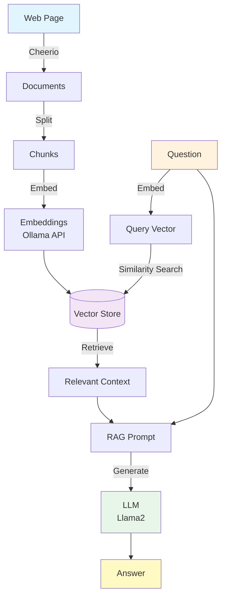

# RAG LangChain Project

A Retrieval-Augmented Generation (RAG) system using LangChain, LangGraph, and Ollama. Loads web content, creates embeddings, and answers questions using Llama2 (locally hosted).

> **Note:** This project is an implementation of the [LangChain RAG Tutorial](https://js.langchain.com/docs/tutorials/rag/).

## Prerequisites

- **Node.js**: v22+
- **Yarn**: Package manager
- **Colima**: Docker runtime with 8GB memory (for llama2)

## Quick Start

```bash
# 1. Ensure Colima has sufficient memory
colima list
colima stop && colima start --memory 8 --cpu 4

# 2. Install dependencies
yarn install

# 3. Start Ollama
docker-compose up -d

# 4. Pull models
docker exec ollama-server ollama pull llama2
docker exec ollama-server ollama pull nomic-embed-text

# 5. Build and run
yarn dev
```

## Usage

### Run the Application

```bash
# Build and run together
yarn dev

# Or separately
yarn build    # Compile TypeScript
yarn start    # Run compiled code
```

**Expected time:** ~110-120 seconds for the complete pipeline with llama2
- Data loading & chunking: ~5-10s
- Embedding creation: ~30-40s
- Retrieval & generation: ~60-80s

*Note: Time varies based on model size. Smaller models (tinyllama) are faster (~30s) but produce lower quality answers. Larger models (mistral, mixtral) take longer but generate better responses.*

## How It Works

1. **Data Loading**: Scrapes web content using Cheerio (selects `<p>` tags by default)
2. **Text Splitting**: Divides content into 1000-character chunks with 200-character overlap
3. **Embedding**: Converts chunks to 768-dimensional vectors using `nomic-embed-text`
4. **Indexing**: Stores vectors in MemoryVectorStore for similarity search
5. **Retrieval**: Finds most relevant chunks based on question similarity
6. **Generation**: Uses LangChain RAG prompt + retrieved context to generate answer with `llama2`

## Configuration

### Models

**Current Configuration:**
- **LLM**: `llama2` (~3.8GB) - Good reasoning and balanced performance
- **Embeddings**: `nomic-embed-text` (~274MB) - 768-dimensional embeddings

### Alternative Models

**LLM Options:**
- `tinyllama` (~637MB) - Faster but limited reasoning, good for testing only
- `mistral` (~4.1GB) - Better reasoning than llama2, requires more RAM
- `mixtral` (~26GB) - Production-quality, best reasoning, requires 16GB+ RAM

**Embedding Options:**
- `all-minilm` (~46MB) - Faster but less accurate
- `mxbai-embed-large` (~670MB) - Higher accuracy

**Note:** Larger models require more memory. You may need to increase Colima and docker-compose memory limits:
- `mistral`: 10-12GB Colima recommended
- `mixtral`: 16GB+ Colima required

### Changing Models

**1. Pull the model:**
```bash
docker exec ollama-server ollama pull mistral
```

**2. Update `index.ts` (line 18):**
```typescript
const llm = new ChatOllama({
  baseUrl: "http://localhost:11434",
  model: "mistral",  // Change model here
  temperature: 0,
});
```

**3. Rebuild:**
```bash
yarn build
```

Browse all models: [ollama.com/library](https://ollama.com/library)

## Troubleshooting

### Error: "model runner has unexpectedly stopped"

**Problem:** Insufficient memory. Running Ollama with llama2 requires:
- Colima: 8GB
- Docker container: 8GB (configured in docker-compose.yml)

**Solution:**

```bash
# Check current memory
colima list

# Restart Colima with more memory
colima stop
colima start --memory 8 --cpu 4

# Restart Ollama
docker-compose down
docker-compose up -d
```

**Free up memory** (if needed):
```bash
# Unload models
curl -X POST http://localhost:11434/api/generate -d '{"model": "tinyllama", "keep_alive": 0}'
curl -X POST http://localhost:11434/api/generate -d '{"model": "nomic-embed-text", "keep_alive": 0}'
```

**Useful commands:**
```bash
# Check memory usage
docker stats ollama-server --no-stream

# Verify Ollama is running
curl http://localhost:11434/api/tags

# Check container logs
docker logs ollama-server
```

## Architecture



## Limitations

- **In-memory storage**: Vector store is cleared on restart (no persistence)
- **Regeneration required**: Embeddings must be recreated each run
- **Context window**: Limited by model's maximum context length (~4K tokens for llama2)
- **Out-of-domain queries**: May produce nonsensical answers for questions outside the indexed content
- **Model performance**: For better results, consider upgrading to `mistral` or `mixtral`

## Tech Stack

- **[LangChain](https://js.langchain.com/)** - Framework for LLM applications
- **[LangGraph](https://langchain-ai.github.io/langgraph/)** - Graph-based workflow orchestration
- **[Ollama](https://ollama.com/)** - Local LLM runtime
- **[Cheerio](https://cheerio.js.org/)** - Web scraping

## Resources

- [LangChain JS Documentation](https://js.langchain.com/docs/)
- [LangGraph Documentation](https://langchain-ai.github.io/langgraph/)
- [Ollama Model Library](https://ollama.com/library)
- [RAG Concepts Guide](https://python.langchain.com/docs/use_cases/question_answering/)
- [Colima Documentation](https://github.com/abiosoft/colima)

## License

MIT