# RAG LangChain Project

A Retrieval-Augmented Generation (RAG) system using LangChain, LangGraph, and Ollama. Loads web content, creates embeddings, and answers questions using Llama2 (locally hosted).

> **Note:** This project is an implementation of the [LangChain RAG Tutorial](https://js.langchain.com/docs/tutorials/rag/)

## 📋 Table of Contents

- [Overview](#overview)
- [Prerequisites](#prerequisites)
- [Quick Start](#quick-start)
- [Project Structure](#project-structure)
- [Usage](#usage)
  - [Part 1: Basic RAG](#part-1-basic-rag)
  - [Part 2: Chat History with Chains](#part-2-chat-history-with-chains)
- [How It Works](#how-it-works)
- [Configuration](#configuration)
- [Important Notes](#important-notes)
- [Troubleshooting](#troubleshooting)
- [Tech Stack](#tech-stack)

## Overview

This project implements a Retrieval-Augmented Generation (RAG) system with progressive enhancements:

**Part 1: Basic RAG** - Simple question-answering without conversation context
- Load web content → Split into chunks → Create embeddings → Retrieve → Generate

**Part 2: Conversational RAG (Chains)** - Maintains chat history for follow-up questions
- Uses history-aware retriever to reformulate questions
- Maintains conversation context across multiple turns
- Executes predictable, single-retrieval pipeline per question

## Prerequisites

- **Node.js**: v22+
- **Yarn**: Package manager
- **Colima**: Docker runtime with 8GB memory (for llama2)

## Quick Start

```bash
# 1. Ensure Colima has sufficient memory
colima list
colima stop && colima start --memory 8 --cpu 4

# 2. Install dependencies
yarn install

# 3. Start Ollama
docker-compose up -d

# 4. Pull required models
docker exec ollama-server ollama pull llama2
docker exec ollama-server ollama pull nomic-embed-text

# 5. Build and run
yarn build

# 6. Run
yarn start:basic        # Basic RAG
yarn start:chat         # Conversational RAG (chains)
```

## Project Structure

```
rag-langchain/
├── 1-basic-rag/
│   └── index.ts              # Basic RAG implementation
├── 2-chat-history/
│   ├── index-with-history.ts # Chains approach with history
│   └── AGENT_NOTE.md         # Why agent approach isn't included
├── package.json
├── tsconfig.json
├── docker-compose.yml
└── README.md
```

## Usage

### Part 1: Basic RAG

Simple RAG pipeline without conversational memory.

```bash
# Run Part 1
yarn start:basic
```

**What it does:**
1. Loads blog post content from Lilian Weng's "Autonomous Agents" article
2. Splits content into 1000-character chunks with 200-character overlap
3. Creates embeddings and indexes using nomic-embed-text
4. Answers a single question: "What is Task Decomposition?"

**Expected time:** ~60-80s

**Example Output:**
```
❓ Question: "What is Task Decomposition?"
🤖 AI: Task decomposition is the process of breaking down complex tasks...
```

### Part 2: Chat History with Chains

Conversational RAG using history-aware retrieval chain.

```bash
# Run Part 2
yarn start:chat
```

**What it does:**
1. Asks: "What is Task Decomposition?"
2. Follows up: "What are common ways of doing it?" (uses history to understand "it" refers to task decomposition)
3. Follows up: "Can you give me specific examples?" (maintains full conversation context)

**Features:**
- ✅ Automatically reformulates questions based on chat history
- ✅ Maintains conversation context across multiple turns
- ✅ Executes **exactly one** retrieval per question
- ✅ Predictable chain execution flow

**Expected time:** ~180-240s (3 questions with full pipeline each)

**Example Conversation:**
```
👤 Human: What is Task Decomposition?
🤖 AI: Task decomposition involves breaking down complex tasks into smaller,
      more manageable steps...

👤 Human: What are common ways of doing it?
      [System reformulates to: "What are common ways of doing task decomposition?"]
🤖 AI: Based on our previous discussion, common methods include Chain of Thought (CoT),
      simple prompting like "Steps for XYZ", and task-specific instructions...

👤 Human: Can you give me specific examples?
      [System reformulates with full context]
🤖 AI: Specific examples include using prompts like "What are the subgoals for
      achieving XYZ?" or providing task-specific instructions...
```

## How It Works

### Part 1: Basic RAG Pipeline

This diagram shows the complete RAG pipeline from data loading to answer generation.

```mermaid
graph TB
    subgraph "Data Preparation (One-Time Setup)"
        A[📄 Web Page<br/>Lilian Weng Blog] -->|Load & Parse| B[📑 Raw Documents]
        B -->|Split Text<br/>1000 chars, 200 overlap| C[📚 Text Chunks]
        C -->|Create Embeddings| D[🔢 Vector Embeddings]
        D -->|Store| E[(Vector Store)]
    end
    
    subgraph "Query Processing (Runtime)"
        F[❓ User Question<br/>'What is Task Decomposition?'] -->|Embed| G[🔍 Query Vector]
        G -->|Similarity Search| E
        E -->|Top K Results| H[📋 Retrieved Context]
    end
    
    subgraph "Answer Generation"
        F --> I[📝 RAG Prompt]
        H --> I
        I -->|Question + Context| J[🤖 Llama2]
        J -->|Generate| K[✅ Answer]
    end
    
    style A fill:#e1f5ff
    style F fill:#fff3e0
    style E fill:#f3e5f5
    style J fill:#e8f5e9
    style K fill:#fff9c4
```



**Key Components:**

1. **CheerioWebBaseLoader**: Scrapes web content, extracting text from HTML
2. **RecursiveCharacterTextSplitter**: Breaks text into overlapping chunks for better context preservation
3. **OllamaEmbeddings**: Converts text to dense vector representations using local embeddings model
4. **MemoryVectorStore**: Stores vectors for fast similarity search (in-memory, not persisted)
5. **Similarity Search**: Finds most relevant chunks using cosine similarity
6. **ChatOllama**: Generates natural language answer using retrieved context

### Part 2: Conversational RAG (Chains)

This diagram shows how chat history is integrated into the RAG pipeline for multi-turn conversations.

```mermaid
graph TB
    subgraph "Chat History Management"
        A[💬 Previous Conversation] 
        B[🆕 New Question<br/>'What are common ways of doing it?']
    end
    
    subgraph "Question Contextualization"
        A --> C[🔄 History-Aware Retriever]
        B --> C
        C -->|Reformulate| D[🤖 Llama2]
        D --> E[📝 Standalone Question<br/>'What are common ways of<br/>doing task decomposition?']
    end
    
    subgraph "Document Retrieval"
        E -->|Embed & Search| F[(Vector Store)]
        F -->|Top K Results| G[📋 Retrieved Context]
    end
    
    subgraph "Answer Generation"
        G --> H[📝 QA Prompt]
        A -->|History| H
        B -->|Question| H
        H -->|Combine Docs Chain| I[🤖 Llama2]
        I --> J[✅ Answer]
    end
    
    subgraph "State Update"
        B --> K[💾 Update History]
        J --> K
        K --> L[📚 Updated History]
    end
    
    L -.->|Next Turn| A
    
    style A fill:#e3f2fd
    style B fill:#fff3e0
    style E fill:#e8f5e9
    style F fill:#f3e5f5
    style J fill:#fff9c4
    style L fill:#fce4ec
```



**Key Components:**

1. **createHistoryAwareRetriever**: Reformulates questions to be standalone using chat history
   - Input: Current question + chat history
   - Output: Reformulated standalone question
   
2. **Contextualize Prompt**: System message instructing LLM to reformulate question
   - "Given chat history and latest question, make it standalone"
   - Preserves original intent with full context

3. **createStuffDocumentsChain**: Combines retrieved docs with prompt template
   - Formats documents into context string
   - Injects into prompt with history

4. **createRetrievalChain**: Orchestrates the complete flow
   - Question reformulation → Retrieval → Answer generation
   - Maintains conversation state

5. **Chat History Array**: `BaseMessage[]` containing alternating Human/AI messages
   - Grows with each conversation turn
   - Used for context in reformulation and answer generation

**Conversation Flow Example:**

```
Turn 1:
  Input: "What is Task Decomposition?"
  Reformulated: "What is Task Decomposition?" (no change needed)
  Answer: "Breaking down complex tasks into smaller steps..."

Turn 2:
  Input: "What are common ways of doing it?"
  Reformulated: "What are common ways of doing task decomposition?"
  Answer: "Common methods include Chain of Thought, prompting..."

Turn 3:
  Input: "Can you give examples?"
  Reformulated: "Can you give examples of task decomposition methods?"
  Answer: "Examples include: 1) 'Steps for XYZ'..."
```

## Configuration

### Models

**Current Configuration:**
- **LLM**: `llama2` (~3.8GB) - Good reasoning and balanced performance
- **Embeddings**: `nomic-embed-text` (~274MB) - 768-dimensional vectors

### Alternative Models

**LLM Options:**
- `tinyllama` (~637MB) - Fast but limited reasoning, good for testing
- `mistral` (~4.1GB) - Better reasoning than llama2
- `mixtral` (~26GB) - Production-quality, best reasoning (requires 16GB+ RAM)

**Embedding Options:**
- `all-minilm` (~46MB) - Faster but less accurate
- `mxbai-embed-large` (~670MB) - Higher accuracy

### Changing Models

**1. Pull the model:**
```bash
docker exec ollama-server ollama pull mistral
```

**2. Update the index.ts files:**
```typescript
// In 1-basic-rag/index.ts and 2-chat-history/index.ts
const llm = new ChatOllama({
  baseUrl: "http://localhost:11434",
  model: "mistral",  // Change here
  temperature: 0,
});
```

**3. Rebuild:**
```bash
yarn build
```

Browse all models: [ollama.com/library](https://ollama.com/library)

## Troubleshooting

### Error: "model runner has unexpectedly stopped"

**Problem:** Insufficient memory. llama2 requires:
- Colima: 8GB minimum
- Docker container: 8GB

**Solution:**

```bash
# Check current memory
colima list

# Restart with more memory
colima stop
colima start --memory 8 --cpu 4

# Restart Ollama
docker-compose down
docker-compose up -d
```

### Slow Performance

**Issue:** Long wait times between steps

**Solutions:**
1. Use a smaller model for testing: `tinyllama` (~30s total)
2. Reduce chunk size in text splitters
3. Increase CPU/memory allocation to Colima

### Chat History Not Working

**Issue:** Part 2 doesn't seem to use previous context

**Check:**
1. Verify the reformulated question in logs - it should reference previous context
2. Ensure chat history is being properly maintained between invocations
3. Try more explicit follow-up questions

### Memory Issues with Multiple Runs

Part 2 runs multiple queries sequentially. To free memory between runs:

```bash
# Unload models from Ollama
curl -X POST http://localhost:11434/api/generate \
  -d '{"model": "llama2", "keep_alive": 0}'
```

## Tech Stack

- **[LangChain.js](https://js.langchain.com/)** - LLM application framework
- **[LangGraph](https://langchain-ai.github.io/langgraph/)** - Graph-based workflow orchestration  
- **[Ollama](https://ollama.com/)** - Local LLM runtime
- **[Llama2](https://ollama.com/library/llama2)** - Meta's open-source language model
- **[Cheerio](https://cheerio.js.org/)** - Web scraping library

## Limitations

- **In-memory storage**: Vector store doesn't persist between runs
- **No streaming**: Responses are generated fully before display
- **Context window**: Limited by model's maximum context length (~4K tokens for llama2)
- **Local only**: Requires local Ollama instance running
- **Model size**: Larger models need more memory

## Resources

- **LangChain Tutorials**:
  - [Part 1: Build a RAG App](https://js.langchain.com/docs/tutorials/rag/)
  - [Part 2: Q&A with Chat History](https://js.langchain.com/docs/tutorials/qa_chat_history)
- **Documentation**:
  - [LangChain JS Docs](https://js.langchain.com/docs/)
  - [LangGraph Documentation](https://langchain-ai.github.io/langgraph/)
  - [Ollama Model Library](https://ollama.com/library)
- **Concepts**:
  - [Chat History Management](https://js.langchain.com/docs/how_to/message_history/)

## License

MIT